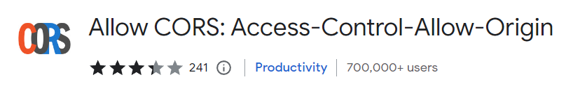
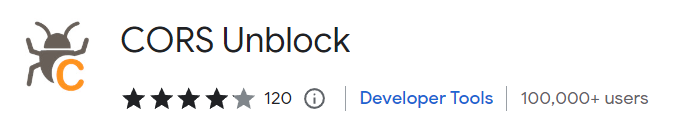
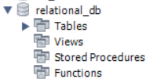
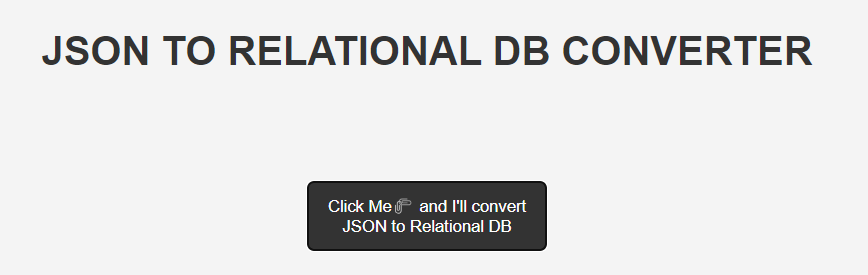
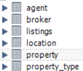
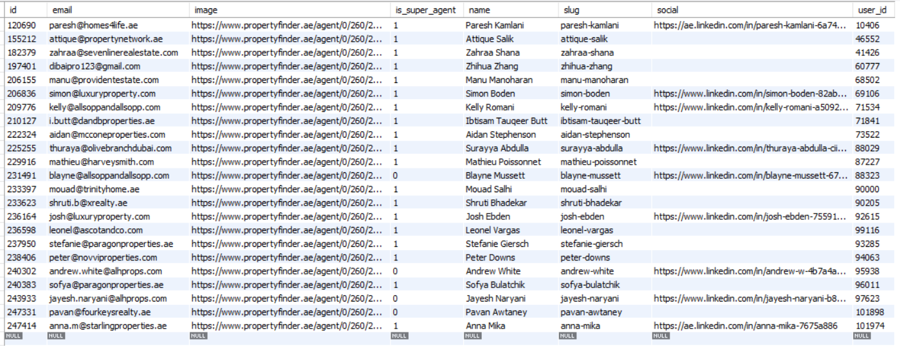

# WELCOME 🎉

### How to use this code

1. Clone this repository
   
2.  ###### To run Server 
    1. Run `npm install` on **"/sever"** directory
    2. Then type `npm start` to run the server
    3. Also to see the databases, you should run the sql simoultenously.

3. ###### To run Client
   1. Install "Live Server" extention on VS Code
   2. Then Install "CORS" extention on your browser
   
   

   OR

   

   3. Make sure to double check the API URL.

3. ###### OUTPUT
    1. Once the server is running, you can see the output on the SQL.
    2. The code will automatically create a database named "relational_db" and the tables. 
    
    3. Now, you will see a "Click Me" button on client side (browser). On Clicking that button will bypass the CORS and fetch the data from the given API and then post it to local server. 
    
    4. On server, I'm storing the relational data to MySQL database. 
    
    

